<h1 align="center">基于SpringBoot+Vue的老年人体检管理系统【带论文】</h1>

- <b>完整代码获取地址：从戎源码网 ([https://armycodes.com/](https://armycodes.com/))</b>
- <b>技术探讨、资料分享，请加QQ群：692619798</b>
- <b>作者微信：19941326836  QQ：3645296857</b>
- <b>承接计算机毕业设计、Java毕业设计、Python毕业设计、深度学习、机器学习</b>
- <b>选题+开题报告+任务书+程序定制+安装调试+论文+答辩ppt 一条龙服务</b>
- <b>所有选题地址 ([https://github.com/Descartes007/allProject](https://github.com/Descartes007/allProject)) </b>

## 一、项目介绍

基于SpringBoot+Vue的老年人体检管理系统，系统角色为管理员（后台管理人员）和普通用户（体检用户/老人），主要功能如下
### 管理员（后台管理）：
- 基本操作：登录、修改密码、获取/修改个人信息
- 用户管理：筛选用户、查看用户详情、新增/修改/删除用户、按角色/权限管理
- 论坛管理：获取帖子列表、查看帖子详情、发布/编辑/删除帖子、帖子状态管理
- 在线咨询管理：获取咨询列表、查看咨询详情、回复/管理咨询
- 健康内容管理：健康常识与疾病预防文章的列表/详情/新增/修改/删除
- 体检项目管理：体检项目增删改查、体检项目预约管理（列表/审核/删除/详情）
- 体检提醒管理：添加/查看/删除/修改体检提醒
### 普通用户（前端/门户）：
- 账户功能：注册、登录、登出、重置密码、修改个人信息、查看个人中心
- 内容浏览：查看健康常识、疾病预防文章、轮播图等前端内容
- 论坛互动：查看帖子、发帖、回复、查看帖子状态
- 在线咨询：发起咨询、查看咨询记录
- 体检服务：查看体检项目、发起体检预约、查看/取消预约、接收体检提醒

## 二、项目技术

- 编程语言：Java（后端）、JavaScript（前端）
- 项目架构：B/S 架构，前后端分离（前端 Vue + 后端 Spring Boot 提供 REST 接口）
- 前端技术：Vue 2、Vue Router、Vuex、Element UI、Axios、js-md5、vue-json-excel、vue-qr、print-js

## 三、运行环境

- JDK版本：1.8及以上都可以
- 操作系统：Windows7/10、MacOS
- 开发工具：IDEA、Ecplise、MyEclipse都可以

## 四、数据库配置文件

- npm版本：6.14.13及以上都可以
- Redis版本：3.2.100及以上都可以
- 文件名：application.yml
- 编码类型：utf8

## 论文截图

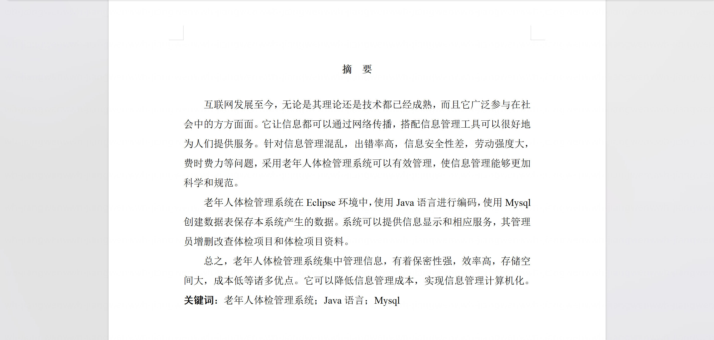

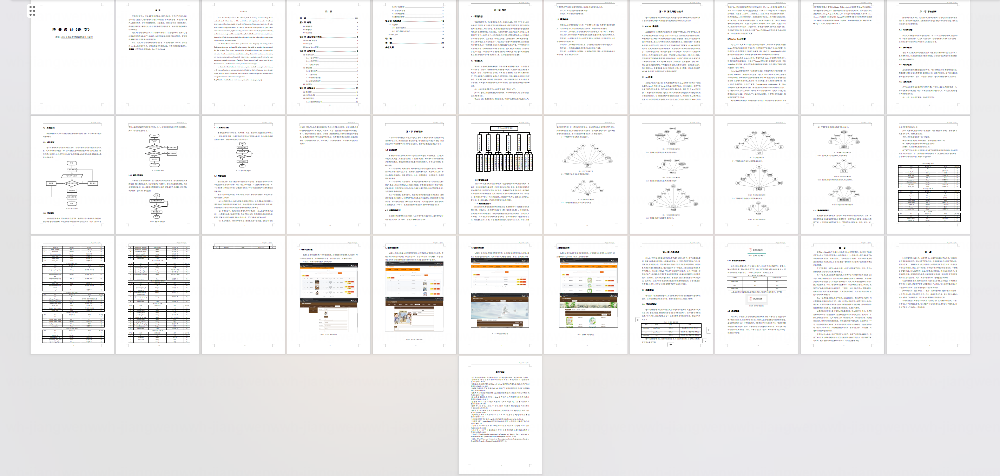

## 系统截图

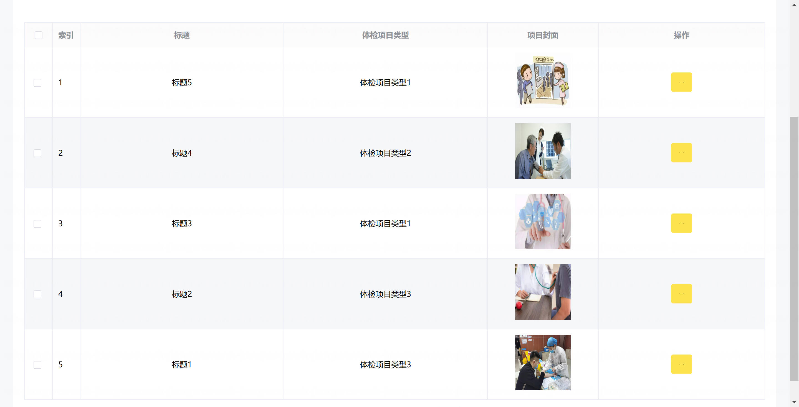

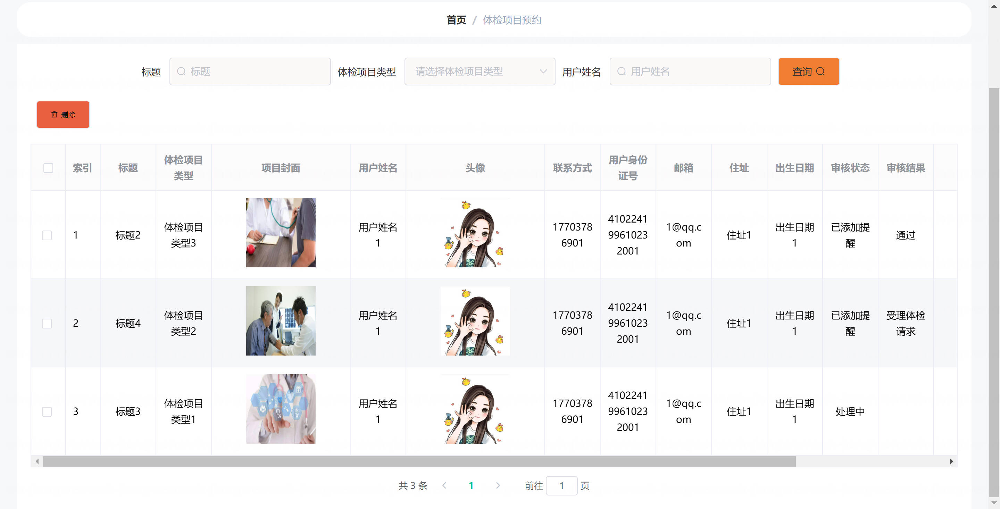

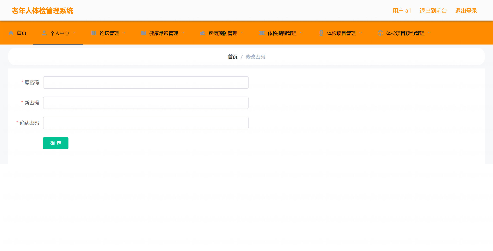

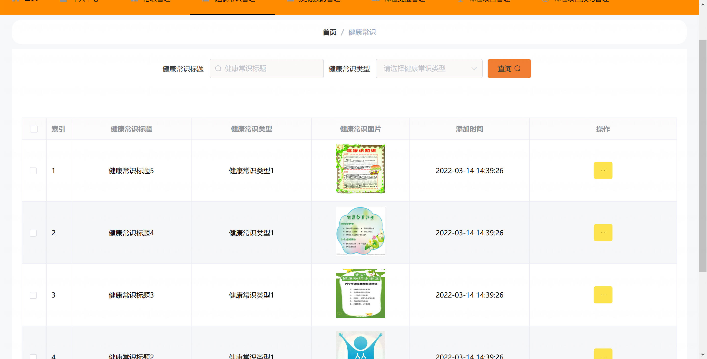

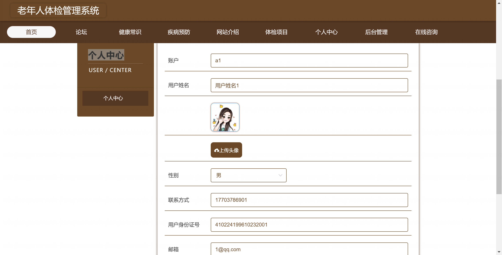

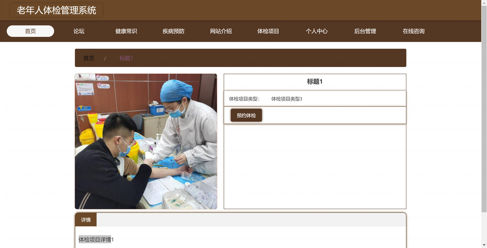

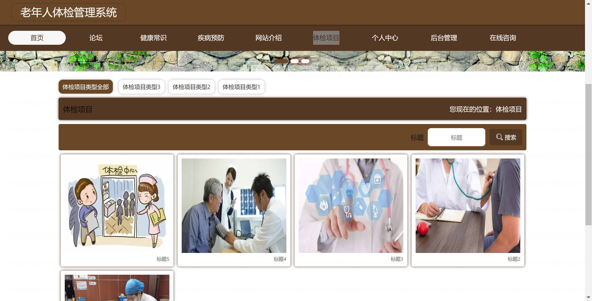

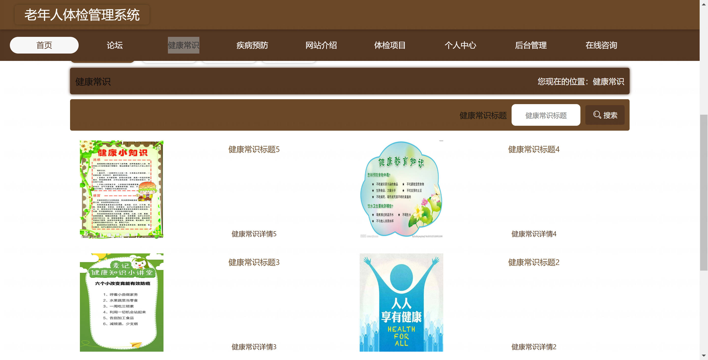

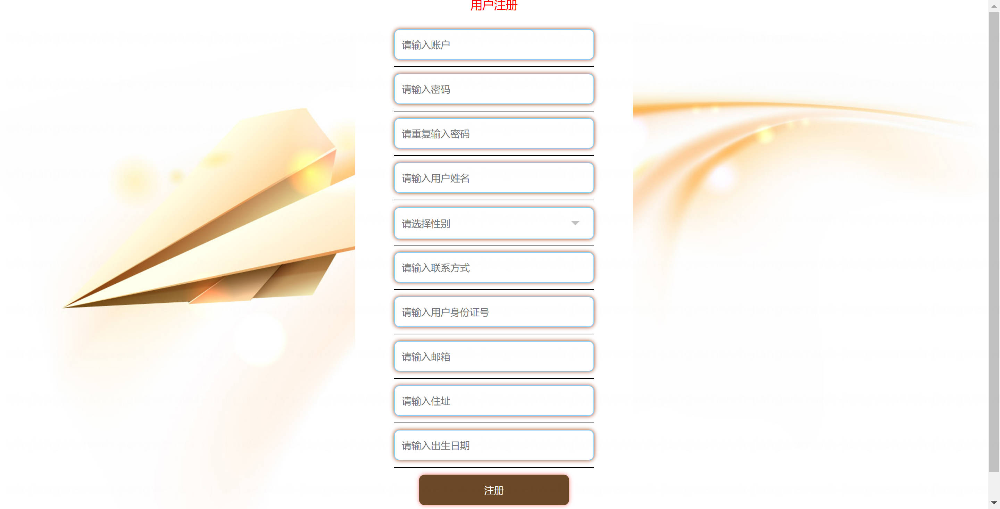

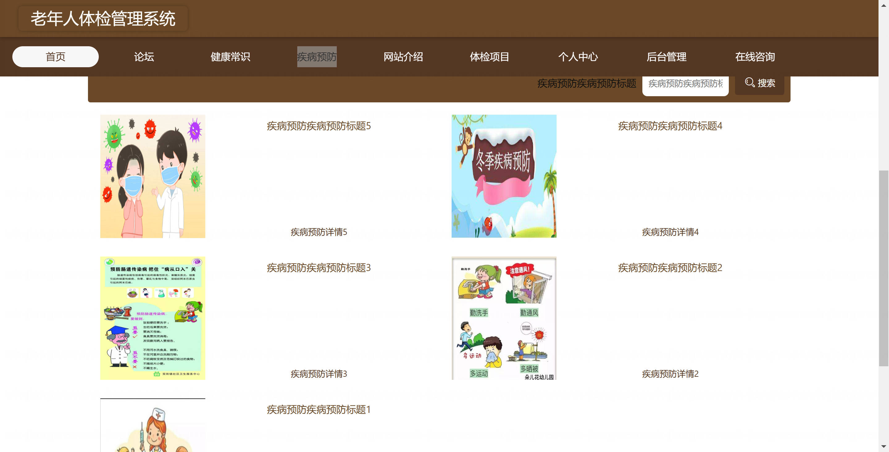
